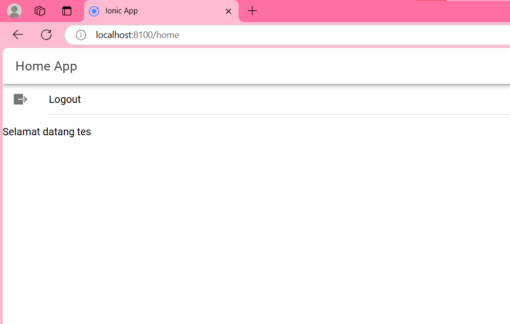

# LabMobile7_SyadinaZufarin_Shift-F
### Link Source Code di Google Drive : https://drive.google.com/file/d/1UeN_ajpok4-jhLInlCHv_Nt_jvssoCqc/view?usp=sharing

### Penjelasan Cara Kerja Login 

### 1. Tahapan Persiapan:
   - Menyiapkan server XAMPP yang digunakan untuk menjalankan PHP API dan database.
   - Di dalam XAMPP, terdapat database yang berisi tabel untuk menyimpan data pengguna (username dan password) dalam project ini yaitu database coba-ionic dengan tabel user.
   - Membuat sebuah PHP API yang bertugas untuk menghubungkan aplikasi IONIC dengan database.

### 2. Alur login di aplikasi IONIC:
   - Di aplikasi IONIC, kita akan membuat sebuah halaman login yang berisi form untuk input username dan password.
   - Ketika mengisi form login dan menekan tombol "Login", aplikasi IONIC akan mengirimkan permintaan HTTP POST ke PHP API.
   - Permintaan HTTP POST akan berisi data username dan password yang dimasukkan oleh pengguna.

### 3. Proses login di PHP API:
   - Saat menerima permintaan login dari aplikasi IONIC, PHP API akan melakukan langkah-langkah berikut:
     - Menerima data username dan password dari permintaan HTTP POST.
     - Membuat koneksi ke database XAMPP.
     - Melakukan query ke database untuk mencari apakah data username dan password yang diterima cocok dengan data yang ada. Di dalam project ini nama user dan password yang harus dimasukkan adalah username : tes dan password : tes123
   - Jika data pengguna valid (username dan password cocok):
     - PHP API akan mengirimkan respon sukses 
   - Jika data pengguna tidak valid:
     - PHP API akan mengirimkan respon gagal 
     - Respon ini dapat berisi pesan kesalahan.
       
### 4. Penanganan login di aplikasi IONIC:
   - Saat menerima respon dari PHP API, aplikasi IONIC akan melakukan hal berikut:
     - Jika respon sukses, aplikasi akan menampilkan halaman dengan tulisan "Selamat datang tes" dan tombol logout.
       - Aplikasi dapat menyimpan token autentikasi atau data pengguna lainnya untuk digunakan dalam interaksi selanjutnya.
     - Jika respon gagal, aplikasi akan menampilkan notifikasi bahwa "username atau password salah"
       
### Screenshoot Aplikasi :

